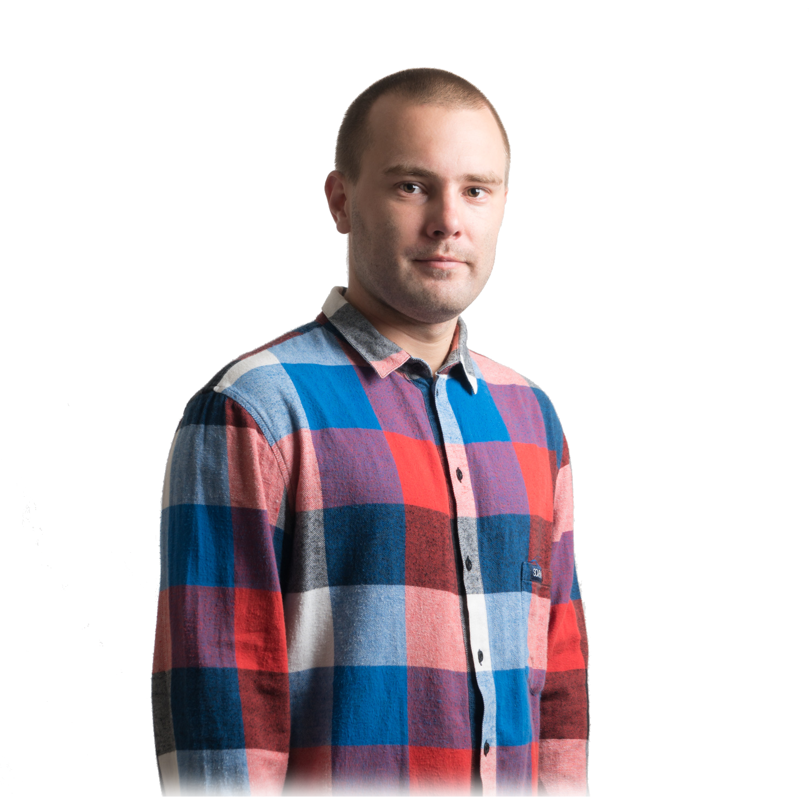

### Kort om mig

Mitt namn är Daniel Andersson född 1986-01-30 i Västerås där jag även bor med min familj. 
Min familj består av min fru Natasha, min son Cerah, min dotter Hulu och vår hund Astrid.

För tillfället arbetar jag på ABB Robotics i Västerås samtidigt som jag studerar vid Blekinge Tekniska Högskola på distansprogrammet webbprogrammering.

När jag inte arbetar eller studerar gillar jag att spendera tid med familjen då vi gärna åker på
dagsutflyckter i närområdet om vädret tillåter det. Mina hobbys har varierat under åren men jag har landat vid en återkommande passion för vågsurfing, skidåkning utför, fotografering & videografering. 
Tyvärr har jag inte så mycket tid över för mina hobbys nu när jag studerar och arbetar samtidigt men ser fram emot att kunna frigöra mer tid för dem när jag är klar med studierna.
